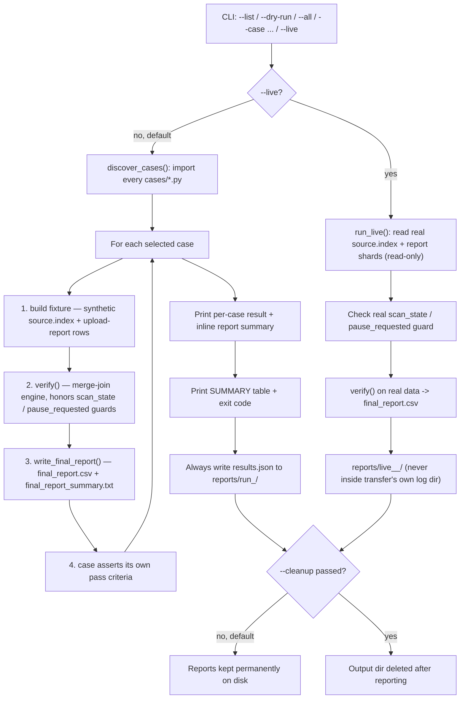

# Phase 4 (Reporting & Verification) — Automation Overview

**For senior review / sign-off**
**Script:** [`verify_and_report.py`](./verify_and_report.py)
**Supporting modules:** [`report_engine.py`](./report_engine.py), [`cases/`](./cases)
**Phase spec this automates:** [`../TestPlan/phases/04_reporting.md`](../TestPlan/phases/04_reporting.md)
**Narrative reference:** [`../docs/planv2.md`](../docs/planv2.md) (Phase 4), [`../docs/bcloud_final_design.md`](../docs/bcloud_final_design.md) §16, [`../docs/bcloud_redesign_proposal.md`](../docs/bcloud_redesign_proposal.md) §5

---

## 1. Purpose

Automates the 8 P0 test cases (P4-01 → P4-08) for the Reporting & Verification phase —
the phase that reconciles what **should** exist on disk (`source.index`) against what
**actually happened** during upload (the upload report), producing a final per-file
status and per-tier summary. This is the "last line of defense that proves a transfer
genuinely succeeded, rather than just the tool exited 0."

No production code, config files, or other test-phase folders are touched. No live
transfer is required or triggered.

---

## 2. Why a reference engine instead of the real one

No live transfer can be initiated in this environment and the real verification
engine binary is not invokable here. `report_engine.py` therefore contains a
**faithful reference implementation** of the documented merge-join algorithm
(last-status-wins, 5-way status classification, ordering/lifecycle guards), built
directly from the spec in `bcloud_redesign_proposal.md` §5 and `bcloud_final_design.md`
§16. This lets every case's *assertion logic* be proven correct today. Swapping in the
real engine later only requires replacing the call to `verify()` inside `report_engine.py`
— no case file or CLI logic changes.

**Known caveat:** P4-06 (progress-counter monotonicity) uses a *simulated* counter
sequence for the same reason — it proves the assertion logic, not the real engine's
live counters. This is explicitly labelled in that case's output (`"caveat": "synthetic
sequence only - not a live-transfer proof"`).

---

## 3. Architecture — plugin-based, extensible

```
CloudCpReportTesting/
├── verify_and_report.py   # CLI + orchestrator: discovers, runs, reports (synthetic + live)
├── report_engine.py       # shared merge-join engine, report I/O, live-mode loaders
├── cases/                 # one file per test case — the only place to add new cases
│   ├── __init__.py
│   ├── p4_01_status_correctness.py
│   ├── p4_02_scan_in_progress.py
│   ├── p4_03_paused_transfer.py
│   ├── p4_04_encoding_safe.py
│   ├── p4_05_dedup.py
│   ├── p4_06_progress_monotonic.py
│   ├── p4_07_tier_summary.py
│   └── p4_08_failure_triage.py
└── reports/               # output — one timestamped folder per run (always kept)
```

Each case file exposes exactly three things:

```python
CASE_ID = "P4-01"
DESCRIPTION = "Exactly one correct status per file"

def run(out_dir):
    ...
    return passed: bool, details: dict
```

`verify_and_report.py` calls `discover_cases()` at startup, which imports every
`cases/*.py` file and collects `(CASE_ID, DESCRIPTION, run)`. **A brand-new test case
— for this phase or a future one — is added by dropping a new file into `cases/`; the
orchestrator itself never needs to be edited.** A malformed/incomplete case file logs
a warning and is skipped rather than crashing the whole run.

---

## 4. Flow



---

## 5. Test cases automated (P4-01 → P4-08)

`P0` = priority tag (release-gating, must-pass). `P4` = Phase 4 (Reporting). `01`–`08`
are just sequence numbers for the 8 individual checks in that phase.

| ID | Case | Pass criteria |
|---|---|---|
| P4-01 | Exactly one correct status per file | Exact per-status counts (`OK/MISSING/FAILED/MISMATCH/EXTRA`), no duplicates, CSV-quoting preserved on embedded commas/newlines |
| P4-02 | Refuse verify while scan in progress | Errors with `scan_state=in_progress, cannot verify`; succeeds once `scan_state=complete` |
| P4-03 | Paused transfer does not trigger verify | Blocked while `pause_requested=True`; proceeds after resume |
| P4-04 | Encoding-safe merge-join | All filename/encoding variants (unicode, spaces, special chars) classified `OK` |
| P4-05 | De-dup — last status wins | Duplicate report rows (`SKIPPED` → `FALLBACK_OK`) collapse to exactly one `OK` row per file |
| P4-06 | Progress counters monotonic | `files_done`/`bytes_done` never decrease across samples *(simulated — see caveat above)* |
| P4-07 | Per-tier completion summary | Per-tier counts sum correctly across all 5 size tiers |
| P4-08 | Failure-summary triage rows | One triage row per permanently-failed file, with full error/retry context |

---

## 5a. Test case details — description, steps, and manual-review guide

Each subsection below documents exactly what the automation does for that case, so it
can be manually re-verified against `cases/<file>.py` and the produced
`final_report.csv`/`final_report_summary.txt` under `reports/run_<timestamp>/<CASE_ID>/`.

### P4-01 — Exactly one correct status per file
**File:** [`cases/p4_01_status_correctness.py`](./cases/p4_01_status_correctness.py)
**Description:** Confirms the merge-join engine assigns exactly one correct final status
to every file, across all 5 possible outcomes, and that the CSV report survives
pathological filenames without corruption.
**Steps performed:**
1. Build 100 source files with a matching `SUCCESS` report row, same size → expect `OK`.
2. Build 20 source files with **no** report row at all → expect `MISSING`.
3. Build 20 source files with a `FAILED` report row → expect `FAILED`.
4. Build 20 source files with a `SUCCESS` report row but a **different size** (1024 vs
   2048) → expect `MISMATCH`.
5. Add 10 report rows with **no** matching source file → expect `EXTRA`.
6. Add one more `OK` file whose name embeds a comma, a double-quote, and a newline, to
   stress CSV quoting.
7. Run `verify()` on the combined 171-file set, write `final_report.csv`, then read it
   back with a real CSV parser (not just count in memory).
8. Count rows per status in the re-parsed file and compare to the expected counts above.
9. Confirm the tricky-named file re-parses back to exactly one `OK` row.
10. Confirm no file path appears more than once in the final parsed report.

**Manual review:** open `P4_01/final_report.csv`, confirm row counts match
`final_report_summary.txt` (`OK=101, MISMATCH=20, FAILED=20, MISSING=20, EXTRA=10`), and
visually inspect the tricky-named row renders as a single well-formed line.

---

### P4-02 — Refuse verify while scan in progress
**File:** [`cases/p4_02_scan_in_progress.py`](./cases/p4_02_scan_in_progress.py)
**Description:** Confirms the ordering guard rejects verification while the source scan
hasn't finished, and allows it once it has.
**Steps performed:**
1. Build one trivial source file + matching `SUCCESS` report row.
2. Call `verify()` with `scan_state="in_progress"` — expect a `VerificationRefused`
   exception with the exact message `scan_state=in_progress, cannot verify`.
3. Call `verify()` again with `scan_state="complete"` on the same data — expect it to
   succeed and classify the file `OK`.

**Manual review:** no report file is produced (nothing to verify against yet); check
the printed `refused_while_in_progress`/`proceeded_when_complete` booleans are both
`true` in `results.json`.

---

### P4-03 — Paused transfer does not trigger verify
**File:** [`cases/p4_03_paused_transfer.py`](./cases/p4_03_paused_transfer.py)
**Description:** Same guard concept as P4-02, but for the `pause_requested` flag instead
of `scan_state`.
**Steps performed:**
1. Build one trivial source file + matching `SUCCESS` report row.
2. Call `verify()` with `pause_requested=True` — expect refusal, message containing
   `"pause_requested"`.
3. Call `verify()` again with `pause_requested=False` — expect success, file classified
   `OK`.

**Manual review:** check `blocked_while_paused`/`proceeded_after_resume` are both `true`
in `results.json`.

---

### P4-04 — Encoding-safe merge-join
**File:** [`cases/p4_04_encoding_safe.py`](./cases/p4_04_encoding_safe.py)
**Description:** Confirms filenames with unicode, spaces, punctuation, and unusually
long segments are matched correctly between source and report — no false `MISSING`s
caused by encoding/comparison bugs.
**Steps performed:**
1. Build 6 source files with deliberately tricky names: plain ASCII, mixed Cyrillic/
   Japanese/emoji, multiple internal spaces, many dots (`.tar.gz`-style), bracket/paren
   characters, and one very long path segment.
2. Give each an exactly-matching `SUCCESS` report row (same path, same size).
3. Run `verify()`, write and re-read `final_report.csv`.
4. Confirm all 6 rows are present and every one classified `OK`.

**Manual review:** open `P4_04/final_report.csv` and visually confirm each of the 6
unusual filenames appears intact (no mangled unicode/truncation) with `Status=OK`.

---

### P4-05 — De-dup: last status wins
**File:** [`cases/p4_05_dedup.py`](./cases/p4_05_dedup.py)
**Description:** Confirms that when a file has two report rows (a stale one followed by
an authoritative one — e.g. an initial `SKIPPED` later superseded by a successful
fallback retry), the engine keeps only the later status and doesn't double-count or
misclassify the file.
**Steps performed:**
1. Build 50 source files.
2. For each, append **two** report rows in order: `SKIPPED` first, then `FALLBACK_OK`
   second (same size both times).
3. Run `verify()` — internally this builds a dict keyed by path, so the second row
   overwrites the first (last-status-wins).
4. Write and re-read `final_report.csv`.
5. Confirm exactly 50 rows exist (not 100 — i.e. no duplicate row per file).
6. Confirm every one of the 50 is classified `OK` (i.e. resolved using the later
   `FALLBACK_OK` row, not the stale `SKIPPED` one).

**Manual review:** confirm `P4_05/final_report_summary.txt` shows exactly `OK: 50` and
no other status — any duplicate or non-OK row indicates the de-dup logic regressed.

---

### P4-06 — Progress counters monotonic *(simulated)*
**File:** [`cases/p4_06_progress_monotonic.py`](./cases/p4_06_progress_monotonic.py)
**Description:** Confirms the assertion logic correctly detects monotonic vs.
non-monotonic counter sequences. **Uses a simulated sequence, not a real transfer** —
see the caveat in §2/§10.
**Steps performed:**
1. Seed a deterministic random generator (`seed=42`) for reproducibility.
2. Simulate 20 samples of `files_done` and `bytes_done`, each sample adding a
   non-negative random increment (never subtracting), capped at `total_files=500`.
3. Check every consecutive pair of samples: `files_done` never decreases, `bytes_done`
   never decreases, and `total_files` is non-zero at every sample point.

**Manual review:** this case has **no `final_report.csv`** (there's nothing to
reconcile — it's purely counters). Review the `samples_taken`/`monotonic_*` fields in
`results.json` and note the `caveat` field confirming this is simulated. Re-run against
a real transfer's real counters before trusting this for production sign-off.

---

### P4-07 — Per-tier completion summary
**File:** [`cases/p4_07_tier_summary.py`](./cases/p4_07_tier_summary.py)
**Description:** Confirms the per-tier rollup (zero/tiny/small/medium/large) correctly
sums file counts, matching the Batch Builder's 5 size tiers.
**Steps performed:**
1. Build a fixed per-tier file count: `zero=20, tiny=40, small=30, medium=15, large=5`
   (110 files total), each tagged with its tier and given a matching `SUCCESS` row.
2. Run `verify()`, write `final_report.csv`.
3. Re-count classified (non-`EXTRA`) results grouped by tier.
4. Compare the recomputed per-tier counts against the original injected counts — must
   match exactly.
5. Confirm the grand total across tiers equals 110.

**Manual review:** cross-check `P4_07/final_report_summary.txt` total row count (110)
against the sum of the `expected_per_tier`/`actual_per_tier` dicts in `results.json`.

---

### P4-08 — Failure-summary triage rows
**File:** [`cases/p4_08_failure_triage.py`](./cases/p4_08_failure_triage.py)
**Description:** Confirms every permanently-failed file produces exactly one triage
record carrying enough context (error message + retry count) to investigate — none
silently dropped.
**Steps performed:**
1. Build 15 source files, each given a `FAILED` report row carrying a realistic error
   message (`"ENOSPC: no space left on device"`) and `retry_count=3`.
2. Run `verify()`, write `final_report.csv`.
3. Filter the results down to `Status == FAILED` rows.
4. Confirm exactly 15 such rows exist (one per injected failure, no drops/duplicates).
5. Confirm every one of those rows carries a non-empty `last_error` and a populated
   `retry_count`.

**Manual review:** open `P4_08/final_report.csv`, confirm all 15 `FAILED` rows are
present at the top (severity-sorted) and each shows the error text — this is the exact
information a human would need to triage real permanent failures.

---

## 6. CLI reference

### Synthetic mode (default, no live transfer needed)
```
verify_and_report.py --list                          # show discovered cases, exit
verify_and_report.py --dry-run --all                 # show plan, execute nothing
verify_and_report.py --all                            # run every discovered case
verify_and_report.py --case P4-01,P4-05               # run specific case(s)
verify_and_report.py --all --verbose                  # detailed per-case breakdown
verify_and_report.py --all --out DIR                  # custom output location
verify_and_report.py --all --open                     # also pop final_report.csv open
verify_and_report.py --all --cleanup                  # delete output dir after reporting
```

### Live mode (real transfer, read-only inputs)
```
verify_and_report.py --live --transfer-id <id> \
    --source-index <path> --report-shards <path1,path2,...> \
    [--manifest <path>] [--dry-run] [--open]
```
- `--source-index` — real `source.index` CSV (read-only)
- `--report-shards` — comma-separated real `upload_report.*`/`txhistory` CSV shards, oldest-first
- `--manifest` — optional `manifest.json` to enforce the same `scan_state`/`pause_requested`
  ordering guards used in P4-02/P4-03, against real transfer state
- `--dry-run` — prints exactly which real files would be read, touches nothing

Exit codes (both modes): `0` all passed · `1` one or more failed / verification refused ·
`2` bad input (unknown case ID, missing required live-mode args, or file read error).

---

## 7. Reports produced (mandatory, kept by default)

Every synthetic run creates `CloudCpReportTesting/reports/run_<timestamp>/`; every live
run creates `CloudCpReportTesting/reports/live_<transfer-id>_<timestamp>/` — always
separate from the real transfer's own log directory.

```
reports/run_20260818_105558/
├── P4_01/
│   ├── final_report.csv            # grouped by severity, minimal quoting
│   └── final_report_summary.txt    # per-status counts
├── P4_02/ ... P4_08/
└── results.json                    # consolidated PASS/FAIL + details, all cases
```

`final_report.csv` schema: `AbsoluteFilePath, S3Path, FileSize, ETag, Status` — rows are
grouped `MISMATCH → FAILED → MISSING → EXTRA → OK` so problems surface first, sorted by
path within each group. A `final_report_summary.txt` with per-status counts is also
printed inline in the console immediately after each case runs — no need to open the
file separately.

Nothing is deleted automatically — pass `--cleanup` to opt into removal after a run.
Consolidated `results.json` is always written, regardless of flags.

---

## 8. Sample console output (actual run, all 8 cases)

```
Running 8 case(s)...

 [PASS] P4-01  Exactly one correct status per file
   final_report_summary.txt:
     final_report.csv summary (171 rows)
     ----------------------------------------
       OK         101
       MISMATCH   20
       FAILED     20
       MISSING    20
       EXTRA      10

 ... (P4-02 .. P4-08 similarly) ...

SUMMARY
------------------------------------------------------------------
 CASE    DESCRIPTION                               RESULT
------------------------------------------------------------------
 P4-01   Exactly one correct status per file       PASS
 P4-02   Refuse verify while scan in progress      PASS
 P4-03   Paused transfer does not trigger verify   PASS
 P4-04   Encoding-safe merge-join                  PASS
 P4-05   De-dup - last status wins                 PASS
 P4-06   Progress counters monotonic               PASS
 P4-07   Per-tier completion summary               PASS
 P4-08   Failure-summary triage rows               PASS
------------------------------------------------------------------
 8/8 cases passed
 Output dir: .../CloudCpReportTesting/reports/run_20260818_105558
 Exit code: 0  (all passed)

 Report JSON written -> .../reports/run_20260818_105558/results.json
 All reports kept at: .../reports/run_20260818_105558
```

### Live-mode dry-run example (no real transfer touched)
```
Plan (dry-run, nothing read):
  transfer id      : demo123
  source.index     : C:\fake\source.index
  report shards    : ['C:\\fake\\report1.csv', 'C:\\fake\\report2.csv']
  manifest         : (none - assumes scan_state=complete)
```

### Live-mode error handling (missing/inaccessible real files - clean, no crash)
```
Reconciling live transfer demo123...
Error reading live inputs: [Errno 2] No such file or directory: 'C:\fake\source.index'
EXIT=2
```

---

## 9. Safety / guardrails

- **No production impact.** Only new files added under `CloudCpReportTesting/`; nothing
  else in the repo (docs, other test-phase folders, config files) is read/written.
- **Read-only against config and real transfer data.** `VERIFICATION.*` settings are
  documented, not loaded or mutated. Live-mode loaders (`load_source_index`,
  `load_upload_report_rows`, `read_transfer_state`) only ever open files for reading.
- **No live transfer required by default.** All fixtures are synthetic in the default
  mode; `--live` is strictly opt-in and requires explicit real paths to do anything.
- **Live mode never writes into a transfer's own log directory** — its own output
  always lands in a separate `reports/live_<id>_<timestamp>/` folder.
- **Idempotent.** Each run gets its own timestamped output folder — re-running never
  overwrites or corrupts a prior run's reports.
- **Fault-isolated discovery.** A broken case file in `cases/` logs a warning and is
  skipped; it cannot crash the whole suite.
- **Fault-isolated live inputs.** Missing/malformed real files produce a clean error
  message and exit code `2`, never a crash/traceback.
- **CI-gateable.** Exit code reflects aggregate pass/fail for automated pipelines.

---

## 10. Known limitations (flagged for reviewer awareness)

1. **P4-06 is simulated**, not proven against a real live transfer (no transfer can be
   initiated in this environment). Needs re-validation once run with `--live` against a
   real in-flight transfer's actual progress counters.
2. **Verification logic is a reference implementation**, not the actual production
   engine binary — it should be cross-checked against the real engine's behavior once
   that binary is invokable in a test environment (see §11, integration plan).
3. **Live mode is scaffolded but untested against real data** — the loaders and CLI
   flags exist and were verified with dry-run + deliberately-missing-file cases, but
   have not yet been run against an actual transfer's real `source.index`/report shards.
4. **`reports/` accumulates** one folder per run over time; not yet wired into
   `.gitignore` or an automatic retention/cleanup policy.

---

## 11. How to extend

To add a new case (this phase or any future one):
1. Create `cases/<name>.py` with `CASE_ID`, `DESCRIPTION`, and `run(out_dir) -> (bool, dict)`.
2. Use `report_engine.verify()` / `write_final_report()` / `src()` / `row()` helpers, or
   write fully custom logic if the case doesn't fit the merge-join model.
3. No other file needs to change — `--list`/`--all` pick it up automatically.

This was proven live: a throwaway `P4-09` demo case file was dropped into `cases/`,
picked up instantly by `--list`/`--case P4-09` with zero edits to the orchestrator, then
removed again — confirming true drop-in extensibility.

---

## 12. Live-transfer integration (added, scaffolded, not yet run against real data)

`report_engine.py` gained three read-only loaders so the same engine and report format
can work against a real transfer instead of synthetic fixtures:

- `load_source_index(path)` — parses a real `source.index` CSV
- `load_upload_report_rows(paths)` — parses real `upload_report.*`/`txhistory` CSV
  shards, oldest-first (last-status-wins still applies on top)
- `read_transfer_state(manifest_path)` — reads real `scan_state`/`pause_requested` from
  a manifest, enforcing the same P4-02/P4-03 ordering guards against real state

`verify_and_report.py` gained a `--live` mode (fully separate code path from the
synthetic cases):

```
verify_and_report.py --live --transfer-id <id> \
    --source-index <path> --report-shards <path1,path2,...> \
    [--manifest <path>] [--dry-run] [--open]
```

- Output goes to its own `reports/live_<transfer-id>_<timestamp>/` folder — **never**
  written into the real transfer's own log directory.
- `--dry-run` prints exactly which real files it would read, without opening any of them.
- Missing/unreadable real files produce a clean error + exit code `2`, not a crash.

**Verified so far (all safe, no real transfer touched):**
- `--live --dry-run` → prints the plan only, reads nothing.
- `--live` against deliberately nonexistent files → clean error, exit code `2`.
- Existing synthetic `--case P4-01` still passes unaffected → confirms no regression
  from adding the live-mode code path.

**Not yet done** (needs sign-off + an actual live transfer, see the step-by-step plan
below):

1. Point `--source-index`/`--report-shards`/`--manifest` at a real transfer's actual
   files — purely a CLI argument change, no code changes needed.
2. Decide reference-engine vs. real-engine-binary: if a real verification tool already
   exists, call it via subprocess and parse its output with the existing
   `read_final_report()`; otherwise this reference `verify()` becomes the tool of record.
3. Re-wire P4-06 to poll real `files_done`/`bytes_done`/`total_files` (progress file,
   API, or DB — wherever exposed) every 5s during a live run, using the same
   monotonicity assertion already written.
4. Add a "don't interfere with an active transfer" guard to `--live` mode itself, beyond
   the existing scan/pause checks on the data being verified.
5. Validation sequence: small low-risk real transfer → `--live --dry-run` (see the plan,
   touch nothing) → real run, spot-check against manual ground truth → full live suite
   including the now-real P4-06.

