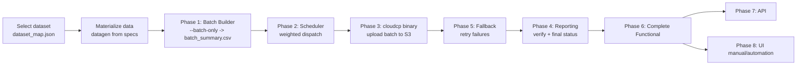

# Complete Test Plan — CloudCP

**Version:** 1.0
**Status:** Living document (coverage is being added phase-by-phase)
**Audience:** Engineering, QA, product stakeholders
**Master document:** this file. Each phase links to its own detailed plan under [phases/](phases/).

---

## 1. What This Plan Covers

This is the **single, complete test plan for the new CloudCP transfer system**. It
consolidates every layer of testing into one classified structure so that any reader can
see, in one place, *what* is tested, *how* it is tested, *with which data*, and *what is
still to be added*.

It covers testing along three orthogonal axes:

1. **Phase-by-phase** — each stage of the pipeline is validated in isolation
   (batch builder → scheduler → cloudcp binary → reporting → fallback).
2. **Complete / end-to-end** — the full flow is validated together
   (source on disk → verified final report).
3. **By functionality surface** — CLI, API, and UI (manual + automation outline).

| # | Layer | What it does | Detailed plan |
|---|---|---|---|
| 1 | **Batch Builder** | Scans the source, groups files by size tier, writes batch files + `batch_summary.csv` | [phases/01_batch_builder.md](phases/01_batch_builder.md) |
| 2 | **Scheduler (Broker)** | Weighted, work-stealing dispatch of batches to cloudcp per network profile | [phases/02_scheduler.md](phases/02_scheduler.md) |
| 3 | **CloudCP Binary** | The C++ engine that uploads a batch file's contents to S3 | [phases/03_cloudcp_binary.md](phases/03_cloudcp_binary.md) |
| 4 | **Reporting & Verification** | Reconciles source index vs upload report → per-file final status | [phases/04_reporting.md](phases/04_reporting.md) |
| 5 | **Fallback & Retry** | Per-file retry safety net for cloudcp failures | [phases/05_fallback.md](phases/05_fallback.md) |
| 6 | **Complete Functional** | Full end-to-end flow across all stages | [phases/06_complete_functional.md](phases/06_complete_functional.md) |
| 7 | **API** | Transfer control surface (start/pause/resume/status/report) | [phases/07_api.md](phases/07_api.md) |
| 8 | **UI (manual + automation)** | Operator-facing screens; manual test plan + automation outline | [phases/08_ui_manual.md](phases/08_ui_manual.md) |
| 9 | **CLI (`bryckclient-cli`)** | Operator CLI: mount/eject/format/erase, cloud configure, transfer initiate/status/pause/resume/cancel/report | [phases/09_cli.md](phases/09_cli.md) |

**Tooling for every phase** is documented once in [tools_guide.md](tools_guide.md).

---

## 2. Priority Model

Every test case in every phase carries a priority. Priorities drive gating and scheduling
of the test effort.

| Priority | Meaning | Included |
|---|---|---|
| **P0** | Must pass before release. Covers **each phase stand-alone**, **complete functionality**, **API**, **UI**, and **manual** verification. | Correctness of batch building, scheduling, upload, reporting, fallback; CLI/API/UI functional flows; manual edge-case checks. |
| **P2** | Lower priority. **Performance** characterization only. | Throughput, request-rate vs bandwidth trade-off, wall-clock baselines, scale runs. |

> There is intentionally **no P1 tier** in this plan. Anything not correctness/functional
> (P0) is performance (P2).

---

## 3. Scope

**In scope**

- Testing the **new CloudCP only**, driven **through the Broker** as configured in
  `/etc/bryck/bryckcloud/config.json` (the broker replaces GNU `parallel`).
- Phase-isolated correctness for batch builder, scheduler, cloudcp binary, reporting,
  fallback.
- Complete end-to-end functional flow.
- CLI testing, API testing, and UI **manual** testing (with an automation outline).
- Multiple **network profiles** and **batch configurations** driven from config.

**Out of scope**

- **Parallel-mode testing** (legacy GNU `parallel` dispatch path).
- **Performance testing** is **low priority (P2)** — captured here for completeness but not
  a release gate.

---

## 4. System Under Test — Configuration Baseline

All runs use the broker configuration at `/etc/bryck/bryckcloud/config.json`. The baseline
used for this plan:

```jsonc
{
  "NETWORK_PROFILE": "dt2_100gbe",
  "BATCH": {
    "BATCH_FILE_DIR": "/opt/bryck/bryckapi/downloads/bcloud_batchmeta",
    "ZERO":   { "BATCH_SIZE": 2000, "TARGET_SIZE_MB": 0,     "OPEN_BATCHES": 4 },
    "TINY":   { "BATCH_SIZE": 511,  "TARGET_SIZE_MB": 256,   "OPEN_BATCHES": 8 },
    "SMALL":  { "BATCH_SIZE": 317,  "TARGET_SIZE_MB": 2048,  "OPEN_BATCHES": 8 },
    "MEDIUM": { "BATCH_SIZE": 50,   "TARGET_SIZE_MB": 10240, "OPEN_BATCHES": 8 },
    "LARGE":  { "BATCH_SIZE": 5,    "TARGET_SIZE_MB": 51200, "OPEN_BATCHES": 8 }
  },
  "LOGGING": {
    "LOGS_DIR":        "/opt/bryck/bryckapi/downloads/cloud_transfer_logs",
    "DEBUG_LOG_FILE":  "/opt/bryck/bryckapi/downloads/cloud_transfer_logs/cloudcp.log",
    "AWS_XFER_STAT":   "/tmp/aws_xfer_stats",
    "AWS_STAT_PREFIX": "/tmp/aws_bryck_zfer_stat"
  },
  "VERIFICATION": {
    "REPORT_FORMAT":         "json",
    "TRANSFER_SUMMARY_FILES":"/etc/bryck/bryckcloud/transfer_summary_files.json",
    "VERIFY_S3_WORKERS":     16,
    "VERIFY_STAT_THREADS":   32
  }
}
```

**Key derived expectations from this config** (used by the batch-builder checks):

| Tier | Count-seal (`BATCH_SIZE`) | Byte-seal (`TARGET_SIZE_MB`) | Open slots |
|---|---|---|---|
| `zero`   | 2000 | n/a (0-byte)        | 4 |
| `tiny`   | 511  | 256 MB              | 8 |
| `small`  | 317  | 2048 MB (2 GB)      | 8 |
| `medium` | 50   | 10240 MB (10 GB)    | 8 |
| `large`  | 5    | 51200 MB (50 GB)    | 8 |

> Config is a **test variable**: several cases re-run the same dataset under different
> `NETWORK_PROFILE` values and different `BATCH.*` sizes to confirm scheduling changes while
> batch packaging stays deterministic. See each phase doc for the profile matrix.

---

## 5. Test Data

Test data is defined by the CloudCP dataset catalog. Two sources of truth:

- **Dataset catalog:** [../dataset_cloudcp/spec_files/dataset_map.json](../dataset_cloudcp/spec_files/dataset_map.json)
  — 54 datasets across 12 categories (name → category / sub-category / purpose).
- **Expected counts manifest:** [../dataset_cloudcp/spec_files/manifest.json](../dataset_cloudcp/spec_files/manifest.json)
  — per-dataset and per-spec expected file counts, buckets, variants, sizes, and roots
  (the *expected* side of every batch-builder comparison).

### 5.1 Dataset categories

| Cat | Name | Primary phase it feeds |
|---|---|---|
| 1 | Single-Tier Isolation | Batch builder, cloudcp binary |
| 2 | Batch Builder Mechanics | Batch builder |
| 3 | Batch Exhaustion / Weight Shift | Scheduler |
| 4 | Filename & Encoding Stress | Batch builder, cloudcp binary, reporting |
| 5 | File Type Coverage | Complete functional |
| 6 | Network Profile Comparison | Scheduler |
| 7 | Mixed Full-Pipeline | Complete functional (P2 perf) |
| 8 | Configuration Edge Cases | Batch builder |
| 9 | Single-File Transfer | cloudcp binary, complete functional |
| 10 | Sub-Range Isolation | Batch builder |
| 11 | Alternative Weight Ratios | Scheduler |
| 12 | Tiny/Small-Heavy Mixed | Complete functional (P2 perf) |

Each phase doc names the **exact `DS-P*` datasets** it consumes.

### 5.2 Getting the data

- Download the materialized dataset files from **0.71** (the dataset host).
- Regenerate spec files / counts from the catalog repo:
  [AdityaJoshi26/dataset_cloudcp](https://github.com/AdityaJoshi26/dataset_cloudcp).
- Generate CSV batch-summary expectations with the scripts in [tools_guide.md](tools_guide.md).

---

## 6. Batch Builder Reference Flow (canonical per-dataset procedure)

This is the structural flow every **batch-builder** test case follows. Full detail and the
case list live in [phases/01_batch_builder.md](phases/01_batch_builder.md).

1. **Select one dataset** (e.g. `DS-P2-02`) from the catalog.
2. **Create the expected specs** — compute the *expected* `batch_summary` (per-tier batch
   count + per-batch file/byte totals) from `manifest.json` using the Python helper.
3. **Start the batch builder** through the broker's enumerator in batch-only mode:
   ```bash
   /opt/bryck/.venv/bryck/bin/python3 \
     /opt/bryck/.venv/bryck/lib/python3.10/site-packages/bryckcloud/lib/cloud/bcloud_src_enum.py \
     -i <transfer-id> </bryck/mount/path/with/data> --batch-only
   ```
   This produces the generated summary at:
   ```
   /opt/bryck/bryckapi/downloads/bcloud_batchmeta/transfer_<id>/batch_summary.csv
   ```
4. **Match** the expected spec-derived summary against the generated `batch_summary.csv`.
5. **Declare PASS / FAIL** per the tolerance rule.

Repeat for every dataset in scope, and repeat selected datasets under alternative
`BATCH.*` / `NETWORK_PROFILE` configs.

The complete Batch Builder test-case register (plan cases + currently automated checks) is
kept as a shareable workbook at
[../CloudCpBatchBuilderTesting/BatchBuilder_TestCases.xlsx](../CloudCpBatchBuilderTesting/BatchBuilder_TestCases.xlsx),
and the automated validation suite lives in
[../CloudCpBatchBuilderTesting/](../CloudCpBatchBuilderTesting/).

---

## 7. High-Level Test Flow



---

## 8. Coverage Status & "To Be Added"

Coverage is **not complete** yet. This plan is authoritative for *intent*; the table below
tracks what assets exist today versus what is still to be added. Each phase doc repeats a
`To be added` block for its own scope.

| Phase | Existing assets | To be added |
|---|---|---|
| Batch Builder | Test plan ([phases/01](phases/01_batch_builder.md)); generation via [dataset_validator.py](../dataset_cloudcp/spec_files/dataset_validator.py); catalog + manifest | Automated expected-vs-actual `batch_summary.csv` comparator; full 54-dataset run harness; config-matrix runs |
| Scheduler | Test plan ([phases/02](phases/02_scheduler.md)); deterministic-enumeration catalog + oracle in [CloudCpSchedulerTesting/](../CloudCpSchedulerTesting/) (`test_cases.md`, `schedular_test.py` capture/replay, sandboxed `schedular_negative_test.py`); 45 P0/P1 cases (enumeration oracle, dispatch, config, pause/resume, negatives) + 3 P2 | Slot-sampling verdict layer; oracle-validation harness; profile-diff automation; convergence measurement |
| CloudCP Binary | **Complete binary suite** in [CloudCpBinaryTesting/](../CloudCpBinaryTesting/) (`plan_cp_binary.md`, `run_cloudcp_tests.py`, `make_batches.py`, positive + negative datasets incl. hostile fs objects N01–N11 and xattr-metadata cases N12–N16, plus the **pause/resume suite PR01–PR06**) | Integrate into master harness; wire to broker-produced batches; confirm xattr preserve/drop policy; PR07 tampered-log + PR-over-malformed-batch |
| Reporting | **Runnable suite** in [CloudCpReportTesting/](../CloudCpReportTesting/) (`verify_and_report.py` + `report_engine.py` + `cases/`, and live `run_report_tests.py` + `live_cases/`); 18 cases — synthetic reference-engine P4-01…P4-08 + live end-to-end RT-01…RT-10 with cross-cutting checks ([phases/04](phases/04_reporting.md)) | Integrate into master harness; real-counter sampler for P4-06; swap reference engine for the real verification engine |
| Fallback | **Runnable fault-injecting suite** in [CloudCpFallbackTesting/](../CloudCpFallbackTesting/) (`plan_cp_fallback.md` + `plan_cp_component_fallback.md`, `cloudcp_fallback_test.py`, `cloudcp_component_fallback_test.py`); 65 cases — API upload/download/min-acceptance/negative (FB-*) + component worker/mp-retry/negative (CFW/CMP-*) with break conditions B1–B9 ([phases/05](phases/05_fallback.md)) | Wire into master harness; resolve open items (plan_cp_fallback.md §16); B4/B6/B8/B9 remediation follow-ups |
| Complete Functional | Test plan ([phases/06](phases/06_complete_functional.md)) | End-to-end runner spanning all stages |
| API | Test plan ([phases/07](phases/07_api.md)) | Endpoint inventory; contract tests |
| UI | Manual plan ([phases/08](phases/08_ui_manual.md)) | Automation harness (Playwright/Selenium) |
| CLI | **Complete CLI suite** in [CloudCpCliTesting/](../CloudCpCliTesting/) (`cloud_cli_plan.md`, two-phase `cloud_cli_runner.py`, `bryckclient-cli` scripts); 41 cases — transfer matrix, live intervention incl. **pause/resume**, service restart, edge, CLI-input + AWS-config negatives ([phases/09](phases/09_cli.md)) | Integrate into master harness; resolve open items (SPARSE spec, sudo for restarts, bucket naming); multi-Bryck + GCP/Azure |

Sources this plan builds on:

- **Narrative test plan:** [../docs/planv2.md](../docs/planv2.md) (Phases 1–4 prose).
- **Binary test plan + runner:** [../CloudCpBinaryTesting/plan_cp_binary.md](../CloudCpBinaryTesting/plan_cp_binary.md).
- **Generation/validation tool:** [../dataset_cloudcp/spec_files/dataset_validator.py](../dataset_cloudcp/spec_files/dataset_validator.py).
- **Design references:** [../docs/batch_builder_design.md](../docs/batch_builder_design.md),
  [../docs/broker_scheduler_redesign.md](../docs/broker_scheduler_redesign.md),
  [../docs/config_reference.md](../docs/config_reference.md).

---

## 9. Test Case Register

The executable step-by-step cases and their pass/fail records are tracked in the workbook:

- **Test case list (master):** [../docs/testcaselist.xlsx](../docs/testcaselist.xlsx)

Per-phase test-case registers (self-contained, live next to each suite):

- **Phase 1 — Batch Builder:** [../CloudCpBatchBuilderTesting/BatchBuilder_TestCases.xlsx](../CloudCpBatchBuilderTesting/BatchBuilder_TestCases.xlsx)
- **Phase 2 — Scheduler / Broker:** [../CloudCpSchedulerTesting/CloudCpScheduler_TestCases.xlsx](../CloudCpSchedulerTesting/CloudCpScheduler_TestCases.xlsx) (enumeration oracle, dispatch/weight/work-stealing, config, pause/resume positive + negative, fault injection, performance, traceability)
- **Phase 3 — CloudCP Binary:** [../CloudCpBinaryTesting/CloudCpBinary_TestCases.xlsx](../CloudCpBinaryTesting/CloudCpBinary_TestCases.xlsx) (incl. positive, negative/hostile, and pause/resume suites)
- **Phase 4 — Reporting & Verification:** [../CloudCpReportTesting/CloudCpReport_TestCases.xlsx](../CloudCpReportTesting/CloudCpReport_TestCases.xlsx) (synthetic reference-engine P4 cases + live end-to-end RT cases + cross-cutting checks)
- **Phase 5 — Fallback & Retry:** [../CloudCpFallbackTesting/CloudCpFallback_TestCases.xlsx](../CloudCpFallbackTesting/CloudCpFallback_TestCases.xlsx) (fault profiles, API upload/download/min-acceptance/negative, component worker/mp-retry/negative, break conditions)
- **Phase 9 — CLI:** [../CloudCpCliTesting/CloudCpCli_TestCases.xlsx](../CloudCpCliTesting/CloudCpCli_TestCases.xlsx) (transfer matrix, live intervention, service/edge, CLI + AWS negatives)

Each phase doc in [phases/](phases/) maps its cases to rows in that workbook (by a
`Phase-<n>-<seq>` case ID). Keep IDs stable so results roll up to this master.

---

## 10. Document Index

| Document | Purpose |
|---|---|
| [complete_plan.md](complete_plan.md) | This master — scope, priority, data, coverage |
| [tools_guide.md](tools_guide.md) | Every tool + its `--help` usage |
| [phases/01_batch_builder.md](phases/01_batch_builder.md) | Batch builder phase plan |
| [phases/02_scheduler.md](phases/02_scheduler.md) | Scheduler / broker phase plan |
| [phases/03_cloudcp_binary.md](phases/03_cloudcp_binary.md) | CloudCP binary phase plan |
| [phases/04_reporting.md](phases/04_reporting.md) | Reporting & verification phase plan |
| [phases/05_fallback.md](phases/05_fallback.md) | Fallback & retry phase plan |
| [phases/06_complete_functional.md](phases/06_complete_functional.md) | End-to-end functional plan |
| [phases/07_api.md](phases/07_api.md) | API test plan |
| [phases/08_ui_manual.md](phases/08_ui_manual.md) | UI manual + automation outline |
| [phases/09_cli.md](phases/09_cli.md) | CLI (`bryckclient-cli`) test plan |
